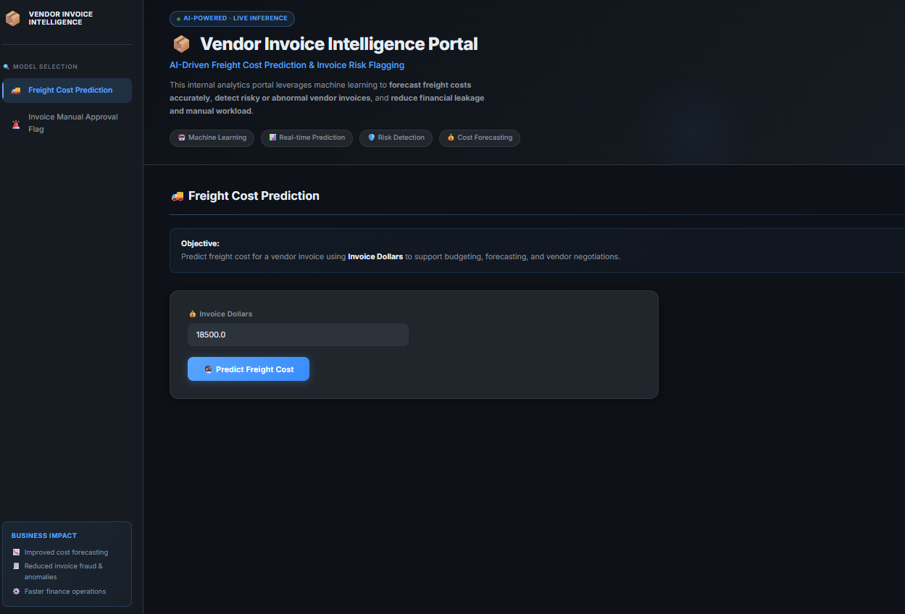
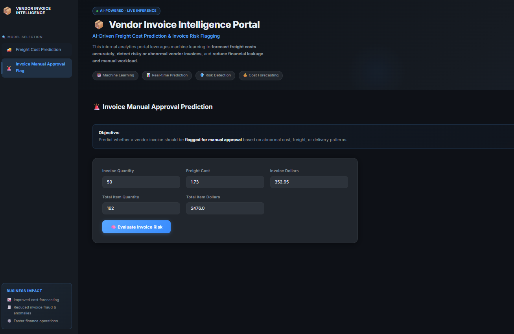

# Vendor Invoice Intelligence System  
**Freight Cost Prediction & Invoice Risk Flagging**

## 📌 Table of Contents
- <a href="#project-overview">Project Overview</a>
- <a href="#business-objectives">Business Objectives</a>
- <a href="#data-sources">Data Sources</a>
- <a href="#eda">Exploratory Data Analysis</a>
- <a href="#models-used">Models Used</a>
- <a href="#metrics">Evaluation Metrics</a>
- <a href="#application">Application</a>
- <a href="#project-structure">Project Structure</a>
- <a href="#how-to-run-this-project">How to Run This Project</a>
- <a href="#author--contact">Author & Contact</a>
---

<h2><a class="anchor" id="project-overview"></a>📌 Project Overview</h2>

This project implements an **end-to-end machine learning system** designed to support finance teams by:

1. **Predicting expected freight cost** for vendor invoices.
2. **Flagging high-risk invoices** that require manual review due to abnormal cost, freight, or operational patterns.

The system is served through a **Django web application** with a premium dark-mode UI, allowing the portal to be deployed as a production-grade web service.

---

<h2><a class="anchor" id="business-objectives"></a>🎯 Business Objectives</h2>

### 1. Freight Cost Prediction (Regression)

**Objective:**  
Predict the expected freight cost for a vendor invoice using quantity, invoice value, and historical behavior.

**Why it matters:**
- Freight is a non-trivial component of landed cost.
- Poor freight estimation impacts margin analysis and budgeting.
- Early prediction improves procurement planning and vendor negotiation.


---

### 2. Invoice Risk Flagging (Classification)

**Objective:**  
Predict whether a vendor invoice should be flagged for manual approval due to abnormal cost, freight, or delivery patterns.

**Why it matters:**
- Manual invoice review does not scale.
- Financial leakage often occurs in large or complex invoices.
- Early risk detection improves audit efficiency and operational control.


---

<h2><a class="anchor" id="data-sources"></a>📂 Data Sources</h2>

Data is stored in a relational SQLite database (`inventory.db`) with the following tables:

- `vendor_invoice` – Invoice-level financial and timing data  
- `purchases` – Item-level purchase details  
- `purchase_prices` – Reference purchase prices  
- `begin_inventory`, `end_inventory` – Inventory snapshots  

SQL aggregation is used to generate **invoice-level features**.

---

<h2><a class="anchor" id="eda"></a>📊 Exploratory Data Analysis (EDA)</h2>

EDA focuses on **business-driven questions**, such as:

- Do flagged invoices have higher financial exposure?
- Does freight scale linearly with quantity?
- Does freight cost depend on quantity?

Statistical tests (t-tests) are used to confirm that flagged invoices differ meaningfully from normal invoices.

---

<h2><a class="anchor" id="models-used"></a>🤖 Models Used</h2>

### Regression (Freight Prediction)
- Linear Regression (baseline)
- Decision Tree Regressor
- Random Forest Regressor (final model)

### Classification (Invoice Flagging)
- Logistic Regression (baseline)
- Decision Tree Classifier
- Random Forest Classifier (final model with GridSearchCV)

Hyperparameter tuning is performed using **GridSearchCV** with F1-score to handle class imbalance.

> **Note:** The trained `.pkl` model files are saved in `models/`. If you encounter a scikit-learn version mismatch when loading the classifier, run `retrain_invoice_flag.py` to regenerate compatible files (see [How to Run](#how-to-run-this-project)).

---

<h2><a class="anchor" id="metrics"></a>📈 Evaluation Metrics</h2>

### Freight Prediction
- MAE
- RMSE
- R² Score

### Invoice Flagging
- Accuracy
- Precision, Recall, F1-score
- Classification report
- Feature importance analysis

---

<h2><a class="anchor" id="application"></a>🖥 End-to-End Application</h2>

The system is served as a **Django web application** with a premium dark-mode interface that mirrors the original Streamlit layout.

### Features
- Sidebar navigation with **Model Selection** (Freight / Invoice Flag)
- **Freight Cost Prediction** — enter Invoice Dollars, get an estimated freight cost
- **Invoice Manual Approval Flag** — enter 5 invoice fields, get a Safe ✅ or Flagged 🚨 result
- Animated result cards with colour-coded success/danger feedback
- Responsive layout with Google Inter font and GitHub-inspired dark palette

### Tech Stack
| Layer | Technology |
|---|---|
| Web Framework | Django 4+ |
| ML Inference | scikit-learn, joblib, pandas |
| Styling | Vanilla CSS (dark-mode, glassmorphism) |
| Database | SQLite (`inventory.db`) — read-only for training |
| Model Storage | Serialized `.pkl` files via joblib |

---

<h2><a class="anchor" id="project-structure"></a>📁 Project Structure</h2>

```bash
Inventory-Invoice-Analytics/
│
├── manage.py                          # Django entry point
│
├── vendor_portal/                     # Django project configuration
│   ├── __init__.py
│   ├── settings.py
│   ├── urls.py
│   ├── wsgi.py
│   └── asgi.py
│
├── portal/                            # Django app — web UI & views
│   ├── __init__.py
│   ├── forms.py                       # FreightForm, InvoiceFlagForm
│   ├── views.py                       # freight_view, invoice_flag_view
│   ├── urls.py
│   ├── static/portal/
│   │   └── style.css                  # Premium dark-mode CSS
│   └── templates/portal/
│       ├── base.html                  # Sidebar layout + hero header
│       ├── freight.html               # Freight prediction page
│       └── invoice_flag.html          # Invoice flag prediction page
│
├── inference/                         # ML inference modules
│   ├── predict_freight.py             # Loads model, runs freight prediction
│   └── predict_invoice_flag.py        # Loads model + scaler, runs flag prediction
│
├── models/                            # Trained serialized models
│   ├── predict_freight_model.pkl
│   ├── predict_flag_invoice.pkl
│   └── scaler.pkl
│
├── freight_cost_prediction/           # Training pipeline — freight model
│   ├── data_preprocessing.py
│   ├── modeling_evaluation.py
│   └── train.py
│
├── invoice_flagging/                  # Training pipeline — flag classifier
│   ├── data_preprocessing.py
│   ├── modeling_evaluation.py
│   └── train.py
│
├── retrain_invoice_flag.py            # Utility: regenerate .pkl files for current sklearn
│
├── data/
│   └── inventory.db                   # SQLite database (read-only for training)
│
├── images/
│   ├── freight-prediction.png
│   └── flag-invoice-prediction.png
│
├── Inventory-Invoice-Analytics/
│   └── notebooks/                     # Jupyter notebooks (EDA & experiments)
│
├── README.md
└── .gitignore
```

---

<h2><a class="anchor" id="how-to-run-this-project"></a>▶ How to Run This Project</h2>

### 1. Clone the repository
```bash
git clone https://github.com/yourusername/inventory-invoice-analytics.git
cd Inventory-Invoice-Analytics
```

### 2. Install dependencies
```bash
pip install django pandas scikit-learn joblib
```

### 3. (Optional) Retrain models
If the pre-trained `.pkl` files cause a scikit-learn version mismatch error, regenerate them with:
```bash
python retrain_invoice_flag.py
```
This reads from `data/inventory.db` and saves fresh, version-compatible files to `models/`.

To retrain the freight model:
```bash
python freight_cost_prediction/train.py
```

### 4. Test inference modules directly
```bash
python inference/predict_freight.py
python inference/predict_invoice_flag.py
```

### 5. Start the Django web application
```bash
python manage.py runserver
```

Then open your browser at: **http://127.0.0.1:8000/**

| URL | Page |
|---|---|
| `/` | Redirects to Freight Prediction |
| `/freight/` | Freight Cost Prediction |
| `/invoice-flag/` | Invoice Manual Approval Flag |

---
<h2><a class="anchor" id="author--contact"></a>Author & Contact</h2>

**Goutam Bhayal**  
Data Scientist  
📧 Email: goutambhayal838@gmail.com 
🔗 [LinkedIn](https://www.linkedin.com/in/goutam-bhayal)
